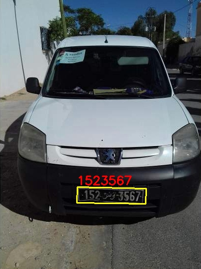
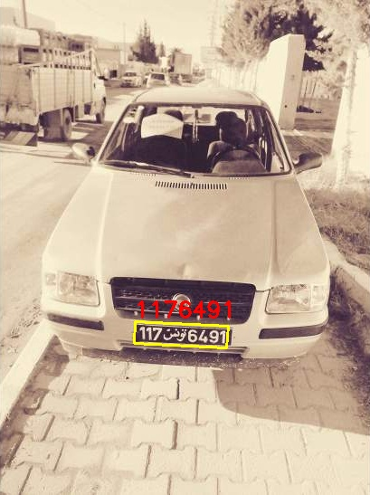
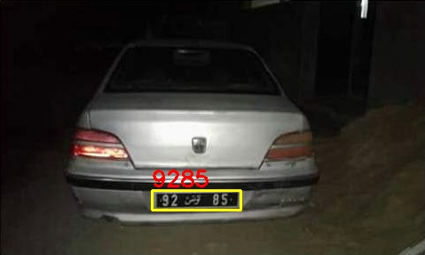
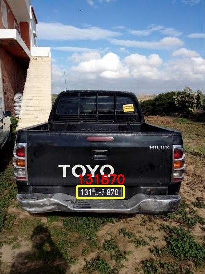
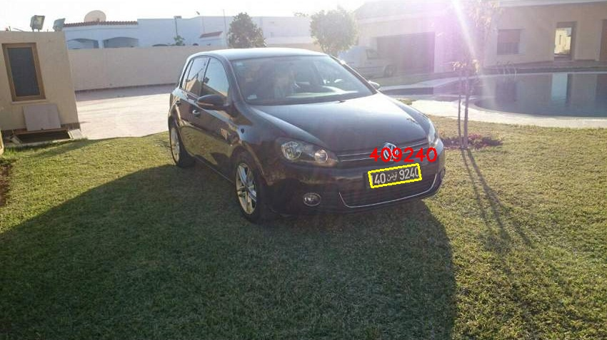
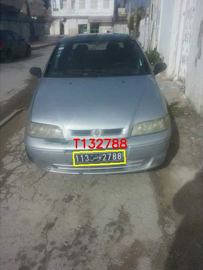
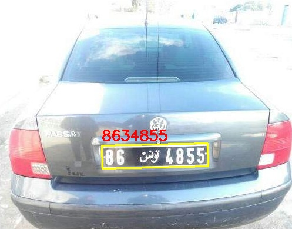
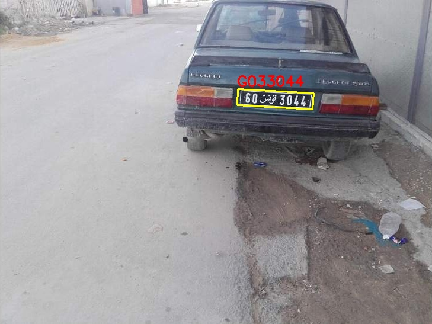
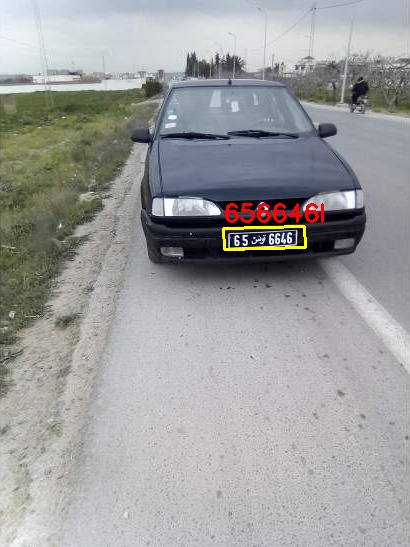
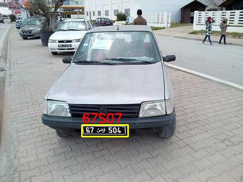

# ALP Recognition from Segmentation


This repository contains code that is able to recognize license-plate characters from images. This project contains the `Segmentation` and `Recognition` parts.

The Segmentation model was built using the UNet architecture because of its very good performance with few annotated images. The data used in training this model is the [`Tunisian vehicle license plates`](https://zindi.africa/competitions/ai-hack-tunisia-2-computer-vision-challenge-2/data) (900 images) got from Zindi.

The Darknet framework was used for the Recognition.

## Requirements
---
**Ubuntu -> 20.04 | Python -> 3.8 | OpenCV -> 4.7.0 | NumPy -> 1.21 | PyTorch -> 1.13.1 | Darknet**

The Darknet framework is in a self-contained 'darknet' folder and needs to be compiled before being used. To compile this, run

``` shellscript
$ cd darknet && make
```

After building the Darknet, one needs to download the necessary data and configuration files by running,

``` shellscript
$ bash get-networks.sh
```


## Making predictions
---
The 'run.sh' is used to execute the ALPR. The script requires 2 arguments:
* __Input directory (-i):__ The input directory which should contain at least one image.
* __Output directory (-o):__ The output directory into which generated data will be saved.

```shellscript
$ bash get-networks.sh && run.sh -i samples/test -o samples/output
```


<table>
<tr>
        <td></td>
        <td></td>
        <td></td>
        <td></td>
        <td></td>
    <tr>
    <tr>
        <td></td>
        <td></td>
        <td></td>
        <td></td>
        <td></td>
    <tr>
<table>

## Training the Segmentation model
You can choose to train the segmentation model from scratch or fine-tune using your own data. This data must live in a directory containing two sub-directories `imgs` and `masks`

```graphql
./data/*
    |--- data/ocr - # Weights and configuration files for OCR
    |--- data/train/* - # Train data
    |   |--- data/train/imgs - # Images for training ('jpg' or 'png')
    |   |--- data/train/masks - # Masks to images with same file name ('jpg' or 'png')
        |--- Everything else - # Files for data processing
    |--- data/unet - # Weights to U-Net model
```

Go on to use the following commands in training the network with your data

```shellscript
$ python3 train.py -p data/train -e 50 -bs 32 --weights data/unet/final_checkpoint
```
for fine-tuning, use the `--weights` argument to specify the path to pre-trained weights.

### Credits
---
* [Zindi: Computer Vision for License Plate Recognition Challenge](https://zindi.africa/competitions/ai-hack-tunisia-2-computer-vision-challenge-2/data)
* [ALPR in Unconstrained Scenarios](https://github.com/sergiomsilva/alpr-unconstrained)
* [U-Net: Convolutional Networks for Biomedical Image Segmentation](https://arxiv.org/pdf/1505.04597)
* [Darknet: Open Source Neural Networks in C](https://pjreddie.com/darknet/)
### ALPR-from-Segmentation
